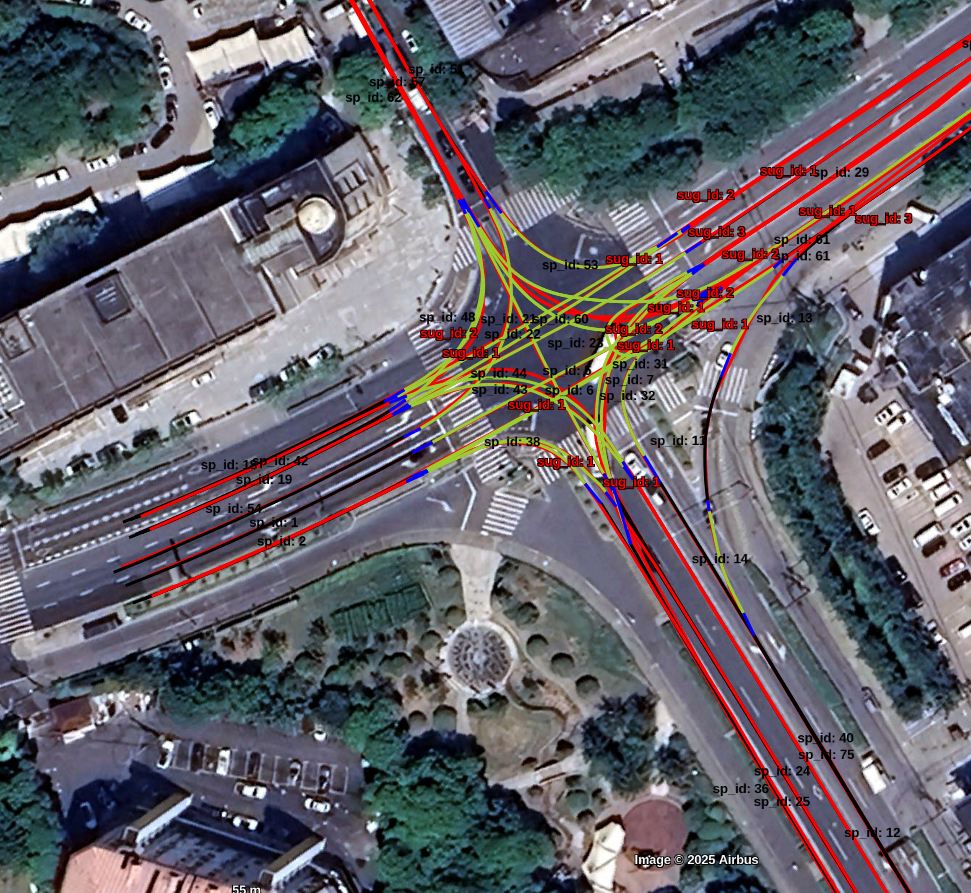
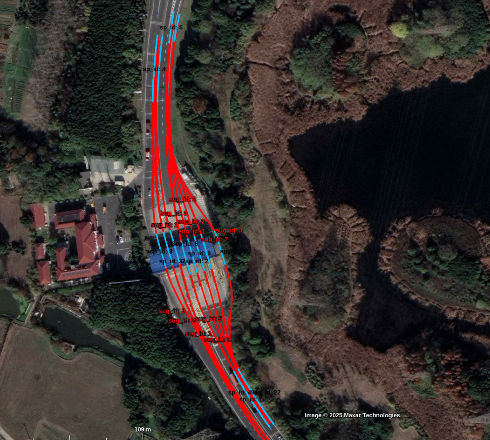
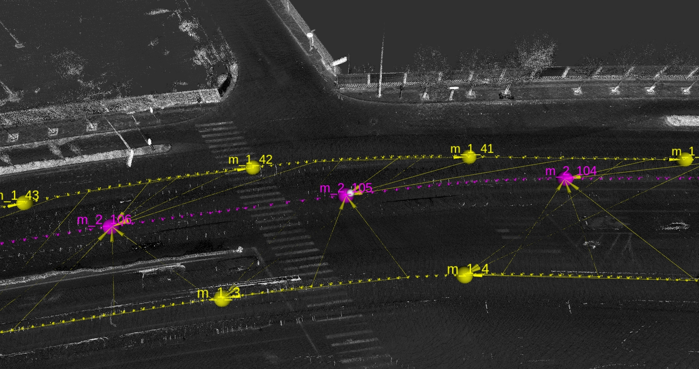
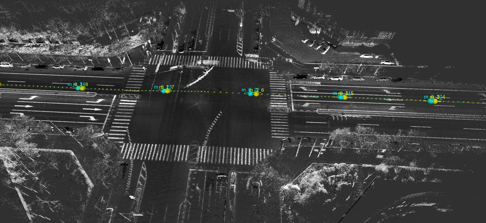

* content
{:toc}

简单记录一些项目。

##  2024.06-至今 | 小米 | 经验轨迹

|   |  |
| :-----------: | :-----------: |
|       |           |
| |  |

路网吸附:
- 通用功能：轨迹，sd, hq 之间 HMM 匹配
- 轨迹吸附到sd路网，生成sd序列，作为路由

轨迹聚类 ：
- 路由内的轨迹进行聚类，DBscan + 矢量参考

拓扑生成：
- 轨迹拟合：参考轨迹 + 多轨迹融合处的 singlepath + 轨迹平滑
- 轨迹选择： HMM 计算先验概率和转移概率，viterbi 选择最佳

## 2023.10-2024.05 | 小米 | 激光众包（多程）建图

|   |  |
| :-----------: | :-----------: |
|       |           |
| |  |

激光单程对齐:  
- v1:使用定位融合结果进行单程帧间对齐和拼接;
- v2:使用定位融合,imu,轮速,rtk紧耦合优化单程

多程对齐:   
- 同一个调度任务内的激光进行track－track的对齐

半自动对齐：  
 - 人工标签

